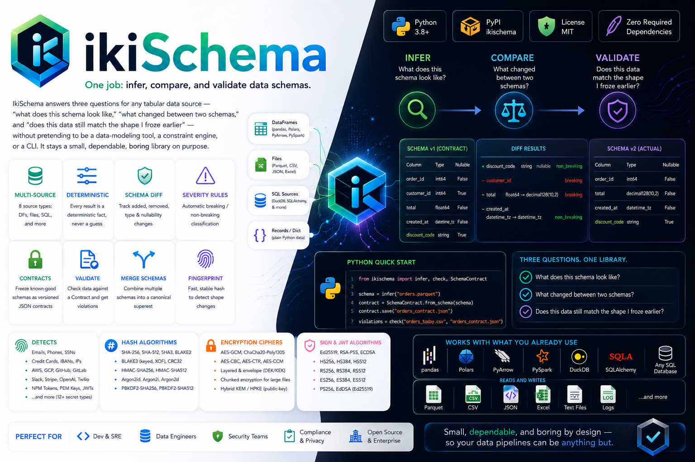

# IkiSchema

**One job:** infer, compare, and validate data schemas.



## What is implemented

This workspace now contains a working Python package for the IkiSchema API described in the blueprint:

- schema inference from records and files
- schema diffing with simple severity rules
- contract creation, saving, loading, and validation
- a facade with infer/diff/check helpers
- regression tests and a runnable example

## Run the tests

```bash
python -m pytest -q
```

## Run the examples

```bash
python examples/quickstart.py
python examples/contract_workflow.py
python examples/diffing.py
python examples/csv_example.py
python examples/json_example.py
python examples/pandas_example.py
python examples/polars_example.py
python examples/schema_contract_example.py
```

## CLI

```bash
python -m ikischema.cli infer '[{"id": 1, "name": "Ada"}]'
```

IkiSchema answers three questions for any tabular data source — "what does this schema look
like," "what changed between two schemas," and "does this data still match the shape I froze
earlier" — without pretending to also be a data-modeling tool, a constraint engine, or a CLI.
It stays a small, dependable, boring library on purpose.

- **No magic.** Every result is a deterministic fact about the data you gave it — never a
  probabilistic guess.
- **Portable.** Works with whichever library you're already using (pandas, Polars, PyArrow,
  PySpark, DuckDB, SQLAlchemy) or plain files (Parquet, CSV, JSON, Excel) — no required
  dependency beyond the Python standard library.
- **Two doors in.** A three-function quick path for the 80% case, and the full class-based API
  underneath for everything else.

## Table of contents

- [Installation](#installation)
- [Quick start](#quick-start)
- [Features](#features)
- [Full API reference with examples](#full-api-reference-with-examples)
- [The Contract file format](#the-contract-file-format)
- [Default severity rules](#default-severity-rules)
- [Supported sources & dtype normalization](#supported-sources--dtype-normalization)
- [Design principles](#design-principles)
- [What this library deliberately does not do](#what-this-library-deliberately-does-not-do)
- [Known limitations](#known-limitations)
- [Project structure](#project-structure)

## Installation

```bash
pip install ikischema
```

Core install has zero required third-party dependencies. IkiSchema works with whichever
libraries you already have installed in your environment (pandas, Polars, PyArrow, DuckDB,
SQLAlchemy, PySpark) — it only imports one when you actually use a method that needs it.

## Quick start

```python
from ikischema import infer, diff, check

# infer a schema from basically anything
schema = infer(df)                                       # pandas / Polars / PyArrow / PySpark DataFrame
schema = infer("orders.parquet", sample_rows=10_000)      # file path
schema = infer(duckdb_relation)                           # DuckDB relation
schema = infer(engine, query="SELECT * FROM orders LIMIT 5000")  # SQL

print(schema)
# name          type          nullable
# order_id      int64         False
# customer_id   int64         True
# total         float64       False
# created_at    datetime_tz   False

# freeze it once you're happy with the shape
from ikischema import SchemaContract
contract = SchemaContract.from_schema(schema)
contract.save("orders_contract.json")

# ...later, in a pipeline / CI job / Airflow task...
violations = check("orders_today.csv", "orders_contract.json")
if violations:
    for v in violations:
        print(v)
        # customer_id: column_removed (expected=present, actual=None)
else:
    print("schema unchanged, safe to load")
```

## Features

- **Infer** a schema from 8 source types: pandas, Polars, PyArrow, PySpark, DuckDB, SQLAlchemy,
  plain records/dict, and files (Parquet, CSV, JSON, Excel).
- **Diff** two schemas — added/removed columns, type changes, nullability changes — with
  configurable `ignore=[...]` (skip volatile audit columns) and `ignore_case=True` (guards
  against exactly the "Snowflake returns uppercase columns" class of bug).
- **Severity classification** — every change is automatically `breaking` or `non_breaking`
  against a documented default rule table, overridable per-Contract via strictness flags.
- **Freeze a Contract** — a versioned, timestamped, JSON-serializable snapshot of a known-good
  schema.
- **Validate** a DataFrame, file path, or another Schema against a Contract — get back a list of
  inspectable `Violation` objects, or opt into `raise_on_breaking=True` to fail fast.
- **Merge** several source schemas into one canonical superset — columns only present in some
  sources are forced nullable; genuine type conflicts are surfaced explicitly rather than
  silently guessed.
- **Fingerprint** — a cheap stable hash of a schema's shape, for fast "did anything change at
  all" pre-checks before paying for a full diff on high-frequency file arrivals.
- **Round-trip serialization** — `to_dict()` / `to_json()` / `deserialize()` for passing a schema
  around as plain data.
- **Typed.** Ships `py.typed` — real mypy/pyright checking for downstream consumers.

## Full API reference with examples

### Inferring a schema

```python
from ikischema import Schema

# dataframes — include_stats and samples are both opt-in
schema = Schema.from_dataframe(df, include_stats=True, samples=False)

# files
schema = Schema.from_path("data.parquet", sample_rows=10_000)   # Parquet reads schema from
                                                                  # file metadata only — never
                                                                  # loads row data to infer
schema = Schema.from_path("data.csv", sample_rows=5_000)
schema = Schema.from_path("data.json", sample_rows=5_000)        # honest about sample_rows only
                                                                  # truly capping disk I/O when
                                                                  # `ijson` is installed
schema = Schema.from_path("data.xlsx")                            # routes through pandas

# SQL / DuckDB
schema = Schema.from_sql(engine, "SELECT * FROM orders LIMIT 5000")
schema = Schema.from_duckdb_relation(relation)

# records
schema = Schema.from_records([{"id": 1, "total": 9.99}, {"id": 2, "total": 12.50}])
schema = Schema.from_record({"id": 1, "total": 9.99})   # infers from a single record

# round-trip
schema = Schema.deserialize(existing_schema_dict)
schema.serialize()  # -> dict
```

### Inspecting a schema

```python
print(schema)                 # human-readable table
schema.columns                # list[ColumnSchema]
schema.column_map()            # {name: ColumnSchema} for quick lookup
schema.to_dict()
schema.to_json()
schema.fingerprint()           # e.g. 'a1b2c3d4e5f6a7b8' — cheap stable hash

for col in schema.columns:
    print(col.name, col.dtype, col.nullable, col.null_count, col.null_ratio, col.sample_values)
```

`ColumnSchema` fields:

| Field           | Type            | Notes                                                                                                                                          |
| --------------- | --------------- | ---------------------------------------------------------------------------------------------------------------------------------------------- |
| `name`          | `str`           |                                                                                                                                                |
| `dtype`         | `str`           | one of the normalized set — see below                                                                                                          |
| `nullable`      | `bool`          |                                                                                                                                                |
| `null_count`    | `int \| None`   | only populated if `include_stats=True`                                                                                                         |
| `null_ratio`    | `float \| None` | only populated if `include_stats=True`                                                                                                         |
| `sample_values` | `list \| None`  | only populated if `samples=True` — **opt-in on purpose**: this exposes real data values, treat it as a data-governance decision, not a default |

### Merging multiple sources into one canonical schema

```python
from ikischema import Schema

schema_a = Schema.from_dataframe(sub_a_df)   # has 'region'
schema_b = Schema.from_dataframe(sub_b_df)   # no 'region', same otherwise

conformed = Schema.merge(schema_a, schema_b)
# 'region' is present but forced nullable=True, since it wasn't in every source

conformed.merge_conflicts
# list[str] — column names where sources disagreed on dtype (resolved to 'unknown'
# rather than silently picking one source's type)
```

### Diffing two schemas

```python
from ikischema import SchemaDiff

result = SchemaDiff.compare(
    schema_yesterday,
    schema_today,
    ignore=["_loaded_at", "etl_batch_id"],   # exclude known-volatile audit columns
    ignore_case=True,                          # case-insensitive column matching
)

result.breaking          # bool
result.added              # list[str]
result.removed            # list[str]
result.type_changes        # list[Violation]
result.nullability_changes  # list[Violation]
print(result.summary())
# "1 breaking change(s).
#  1 column(s) removed: ['customer_id']
#  total: type_changed (expected=float64, actual=string)"
result.to_dict()
```

### Freezing and validating a Contract

```python
from ikischema import SchemaContract, ContractViolationError

contract = SchemaContract.from_schema(schema, strictness={"widening_is_breaking": False})
contract.save("orders_contract.json")

contract = SchemaContract.load("orders_contract.json")

# returns a list — empty means valid
violations = contract.validate(new_df)

# or raise directly
try:
    contract.validate(new_df, raise_on_breaking=True)
except ContractViolationError as e:
    breaking = [v for v in e.violations if v.severity == "breaking"]
    raise SystemExit(f"blocking load: {breaking}")
```

`contract.validate()` accepts a DataFrame (any supported library), a file path, a dict, a list of
records, a DuckDB relation, or another `Schema` — all coerced through the same dispatch logic
`infer()` uses.

### The facade — the 80% quick path

```python
from ikischema import infer, diff, check

schema = infer(df)
schema = infer("orders.parquet", sample_rows=10_000)
schema = infer(engine, query="SELECT * FROM orders LIMIT 5000")   # SQL needs the query= kwarg,
                                                                     # since it's a two-argument
                                                                     # operation under the hood

result = diff(schema_a, schema_b, ignore_case=True)

violations = check(new_df, "orders_contract.json")
violations = check("orders_today.csv", "orders_contract.json")
```

These three functions are deliberately the _only_ facade functions — they're thin dispatchers,
not a second API with its own logic. `Schema`, `SchemaDiff`, and `SchemaContract` are equally
public for anything needing more control.

### Real pipeline pattern — pre-flight check before a load

```python
from ikischema import check

violations = check("bronze/orders_today.csv", "contracts/orders_v1.json")
if violations:
    raise ValueError(f"upstream file failed schema contract: {violations}")
```

### Fast pre-check before paying for a full diff

```python
from ikischema import infer

last_fingerprint = load_last_known_fingerprint()
schema = infer("bronze/orders_today.csv")

if schema.fingerprint() == last_fingerprint:
    print("no schema change, skip full diff")
else:
    result = diff(load_last_schema(), schema)
```

### Exception handling

```python
from ikischema import (
    infer, SchemaInferenceError,
    SchemaContract, ContractLoadError, ContractViolationError,
)

try:
    schema = infer("bronze/corrupted_export.csv")
except SchemaInferenceError as e:
    log.error(f"could not infer schema, quarantining file: {e}")

try:
    contract = SchemaContract.load("missing_or_corrupt.json")
except ContractLoadError as e:
    log.error(f"contract file problem: {e}")
```

`IkiSchemaError` is the base class for everything the library raises, if you want one catch-all.

## The Contract file format

What `contract.save("orders_contract.json")` actually writes:

```json
{
	"ikischema_contract_version": "1.0",
	"created_at": "2026-07-25T00:00:00Z",
	"strictness": {
		"widening_is_breaking": false,
		"additions_are_breaking": false
	},
	"columns": [
		{ "name": "order_id", "dtype": "int64", "nullable": false },
		{ "name": "customer_id", "dtype": "int64", "nullable": true },
		{ "name": "total", "dtype": "float64", "nullable": false },
		{ "name": "created_at", "dtype": "datetime_tz", "nullable": false }
	]
}
```

- `ikischema_contract_version` is the _contract format_ version — separate from the package's own
  PyPI version, so a `0.2.0` package release doesn't imply the contract JSON shape changed.
- `strictness` holds override flags for the default severity rules below. An empty `{}` means "use
  all defaults."
- `columns` is a serialized `list[ColumnSchema]`, minus stats/samples — a Contract describes
  _shape_, never a data snapshot.

## Default severity rules

Used unless a Contract's `strictness` overrides them:

| Change                                 | Default severity                                        |
| -------------------------------------- | ------------------------------------------------------- |
| Column removed                         | breaking (never overridable)                            |
| Column added                           | non_breaking (overridable via `additions_are_breaking`) |
| Nullable → non-nullable (tightened)    | breaking                                                |
| Non-nullable → nullable (loosened)     | non_breaking                                            |
| Type narrowed (e.g. `float64`→`int64`) | breaking                                                |
| Type widened (e.g. `int64`→`float64`)  | non_breaking (overridable via `widening_is_breaking`)   |
| Type changed to/from `unknown`         | breaking                                                |
| `datetime` ↔ `datetime_tz`             | breaking                                                |
| Column in `ignore=[...]`               | never evaluated                                         |

## Supported sources & dtype normalization

Every source normalizes onto a fixed set: `string, int64, float64, bool, datetime, datetime_tz,
date, binary, unknown`.

| Source                      |
| --------------------------- |
| pandas DataFrame            |
| Polars DataFrame            |
| PyArrow Table               |
| PySpark DataFrame           |
| DuckDB relation             |
| SQLAlchemy engine + query   |
| Parquet / CSV / JSON file   |
| Excel `.xlsx`               |
| list of dicts / single dict |

`unknown` is a deliberate, documented catch-all — not a bug — for columns that can't be
confidently normalized (genuinely mixed-type values, unsupported nested structures, etc.).

## Design principles

- **No magic.** Every output is a deterministic fact, never a probabilistic guess. (An earlier
  draft included a fuzzy "possible rename" hint on diffs — it was deliberately cut for exactly
  this reason, even though it was harmless and non-authoritative.)
- **No configuration objects, no plugin system, no global state.**
- **The facade is additive, not a replacement.** `infer()`/`diff()`/`check()` are thin dispatchers
  over the real class-based API — never a second, competing surface with its own logic.
- **Nullability and dtype are always explicit, never inferred loosely.**

## What this library deliberately does not do

These were considered and explicitly rejected, not overlooked:

- **Deep constraint mining** (min/max, regex, uniqueness, foreign keys) — a different, much larger
  problem than schema shape.
- **Data modeling methodologies** (Entity-Relationship, Dimensional/Kimball, Data Vault hub-link-
  satellite classification) — those are schema _design_ concerns; IkiSchema only inspects schemas
  that already exist.
- **MongoDB / other schema-less NoSQL sources** — these don't have a fixed per-row shape by
  design, so "inferring a schema" from them is fundamentally a probabilistic sampling operation,
  which conflicts with this library's deterministic-facts guarantee.
- **Automatic schema evolution suggestions, database catalog integration, a web UI or server, a
  plugin/registry system.** A thin CLI wrapper may come later, but isn't part of the core library.

## Known limitations

Honest, currently-open gaps — not silently glossed over:

- **SQL type mapping** (`Schema.from_sql`) currently returns `dtype="unknown"` for every column.
  DBAPI `type_code` → normalized dtype is driver-specific (psycopg2 vs. Snowflake connector vs.
  pyodbc all report differently) and needs a small per-driver adapter rather than one generic
  table.
- **DuckDB relation nullability** is currently hardcoded to `True` pending a real null-count query
  against the relation.
- **PySpark `include_stats=True`** doesn't compute null counts yet — needs a live Spark session to
  write and test the aggregation.
- **JSON `sample_rows`** only genuinely caps disk I/O when streaming support is available in the
  environment; otherwise it warns and falls back to a full read.

## Project structure

```
ikischema/
├── __init__.py       # public exports: the facade + the full class-based API
├── facade.py          # infer() / diff() / check() — thin dispatchers only
├── schema.py           # Schema + ColumnSchema, coerce_to_schema()
├── infer.py            # format-specific inference implementations
├── diff.py             # SchemaDiff + Violation, severity rules
├── contract.py          # SchemaContract + validation
├── types.py             # dtype normalization mappings, one per source library
├── exceptions.py         # IkiSchemaError and subclasses
├── utils.py              # small shared helpers (numeric parsing, null ratio)
└── py.typed               # typed-package marker
```

Minimum Python: 3.10 (uses `X | None` union syntax throughout).
